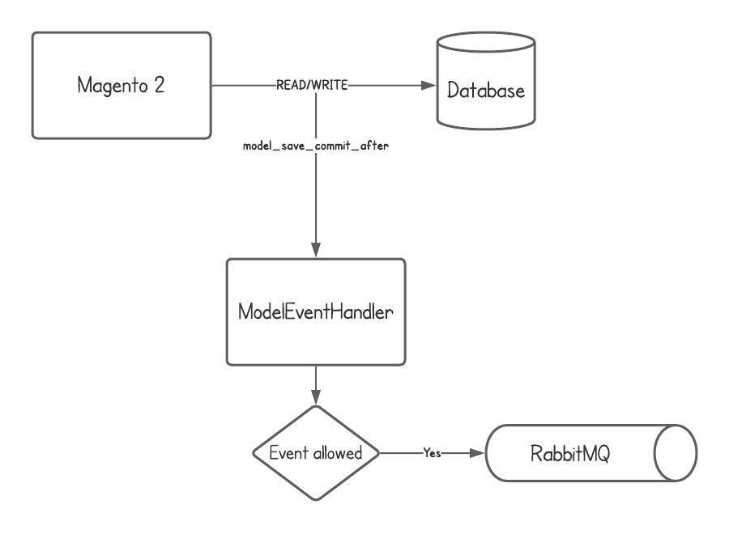

# Magento Webhooks Module

## Introduction
This is an event-driven implementation of webhooks for Magento 2

## Contents
1. [What are webhooks](#what-are-webhooks?)
2. [How this module works](#how-this-module-works)
3. [Requirements](#requirements)
4. [Geting started](#getting-started)
5. [Advanced](#advanced-usage)
    1. [Custom notifier implementations](#custom-notifier-implementations)

## What are webhooks?
Webhooks refers to a combination of elements that collectively create a
notification and reaction system within a larger integration. [[1]](#references)

Metaphorically, webhooks are like a YouTube subscription. You can subscribe to
channels and then later on when the channel publishes new videos, they are
delivered to your feed. In this case, Youtube is the publisher and you are the
consumer.

Similary in the context of Magento, let's say an external system wants to
subscribe to customer account creations, you'll need some functionality to
perform that. This module does exactly that.

Basically, we are YouTube (Magento) and we have many channels (entities) and
users (external systems) can subscribe to changes happening within our system
and they get notified.

This module supports notifying external systems whenever **ANY** entity is
either created or updated. However, you need to specify which entities you want
to support explicitly.

## How this module works
Whenever Magento writes to the databse, it triggers a `model_save_commit_after`
event. This module attaches an event listener to that event and publishes
messages to a rabbitmq queue if that event is configured/whitelisted.



A consumer then reads from the queue and loads the subscribers to that event
and dispatches a 'notification'.

The list of events that can be subscribed to are derived from an `eventPrefix`
and an `action` suffix.

### Currently supported action suffixes
* `_created`
* `_updated`

For example if you have a custom entity called `Equipment` with the event prefix
`equipment`, then the create events of that entity resolve to `equipment_created`
and update events resolve to `equipment_updated`. You can basically derive the
event subscription id for any entity if you have the event prefix.

Some examples are

* `customer_created`

* `customer_updated`

* `sales_order_created`

* ... and so on

## Requirements
1. PHP `~7.4`
2. Magento
3. RabbitMQ

## Getting started
1. Install this module with composer.

`composer require aligent/webhooks`

Make sure you have RabbitMQ configured in your `env.php`

Example:
```php
'queue' => [
    'consumers_wait_for_messages' => 1,
    'amqp' => [ // important, must be named amqp
        'host' => 'mq',
        'port' => '5672',
        'user' => 'guest',
        'password' => 'guest',
        'virtualhost' => '/'
    ]
]
```

2. Configure the package

Let's say you want to allow subscriptions to `customer_created` and
`sales_order_updated` events; you'll need to override the `events` constructor
argument for `Aligent\Webhooks\Service\Webhook\ModelEventHandler` as follows in
a `di.xml`

```xml
    <type name="Aligent\Webhooks\Service\Webhook\ModelEventHandler">
        <arguments>
            <argument name="events" xsi:type="array">
                <item name="customer_created"xsi:type="string">customer_created</item>
                <item name="sales_order_created" xsi:type="string">sales_order_updated</item>
            </argument>
        </arguments>
    </type>
```

3. Run a consumer

Because this is asynchronous the messages don't get processed unless you have a
consumer running to receive messages from the queue and process it.

`bin/magento queue:consumer:start webhook.trigger.handler &`

4. Create a webhook

Webhooks can be created using provided REST API. To create a webhook, send a
POST request to `V1/webhook` with the necessary data.

Example:
```js
{
    "webhook": {
        "event_name": "customer_created", // important: this value must be in one of  your configured values in di.xml
        "recipient_url": "https://localhost/endpoint", // destination
        "verification_token": "supersecret" // a secret token that can be used for signing
    }
}
```

It's all done. Now whenever any customer is created in magento, a notification
will be sent to the specified url as a POST request.

## Default factory and notifier
The default `NotifierFactory` just creates a default `HttpNotifier` which takes
in a webhook and an object ID and sends a `POST` request with ID in the request
body to the recipient url. It also signs the payload with a SHA-256 hmac hash
for verification.

This can be overriden using custom implementations. See
[Advanced usage](#advanced-usage) for implementing custom notifiers.


## Advanced usage
A webhook notifier doesn't necessarily need to just send a `POST` request to
an `https` url.

You might just want to customize what's in the `POST` request's
body or, you might want to send a `GET` request instead or, you might want to
notify something else running within your system; perhaps you want to use inter
process communication, you want to use network sockets, writing to disk, anything!

### Custom notifier implementations
Firstly, you'll need a custom `NotifierFactory` which implements the
`NotifierFactoryInterface` for that. Then you'll need to add a class preference
in a `di.xml`

**The factory decides which notifier to use for that webhook based on some metadata.**

```xml
    <preference for="Aligent\Webhooks\Service\Webhook\NotifierFactoryInterface"
                type="Some\Module\Service\MyFactory" />
```

An example custom implementation could look like

```php
class MyFactory implements NotifierFactoryInterface
{

    /**
     * {@inheritDoc}
     */
    public function create(Webhook $webhook, string $objectData): NotifierInterface
    {
        switch ($webhook->getNotifierType()) { // TODO: This method is not yet implemented
            case 'http':
                return new Some\Module\Service\HttpNotifier(
                    $this->client,
                    $webhook->getRecipientUrl()
                );

            case 'socket',
                return new Some\Module\Service\SocketNotifier();


            default:
                throw new Exception(__("Cannot resolve %1, did you forget to add an implementation?"));
        }
    }
}
```

Note that we now have specified two custom notifiers, `HttpNotifier` and
`SocketNotifier` which means we'll also have to implement them.

#### HttpNotifier
```php
class HttpNotifier implements NotifierInterface()
{
    public function __construct(Client $client, string $url)
    {
        // initialize arguments
    }

    public function notify(): NotiferResult
    {
        // Adding data to the request body
        $body = [
            'custom_data' => 'The spectacle before us was indeed sublime',
            'customer_data'
        ];

        // Throw in some custom headers
        $headers = [
            'X-Custom-Header' => 'Custom Header',
        ];

        $response = $this->client->post(
            $this->url,
            [
                'headers' => $headers,
                'json' => $body
            ]
        );

        return new NotifierResult([
            'result' => $response->getstatusCode() >= 200 && $response->getstatusCode() < 300,
            'metadata' => 'Some Metadata'
        ]);
    }
}
```

#### SocketNotifier
```php
class SocketNotifier implements NotifierInterface()
{
    public function notify(): NotifierResult
    {
        // Inter-process communciation, writing to disk, etc
    }
}
```

## References
1. https://stripe.com/docs/webhooks
