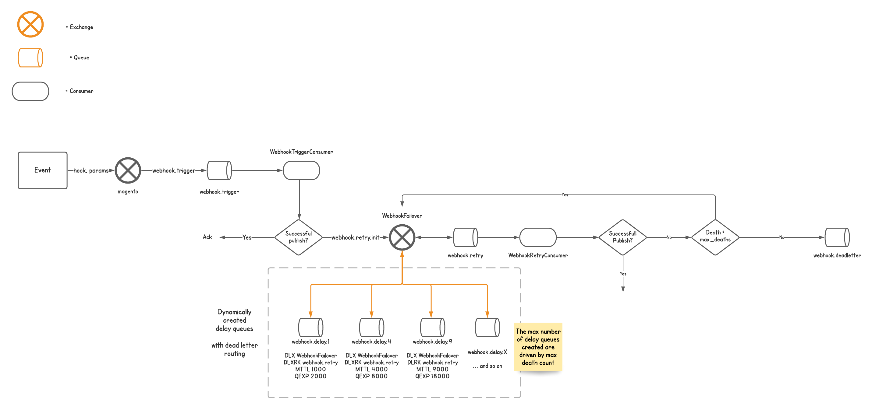

# Webhooks 2.1
A framework for writing reliable and asynchronous webhooks with Magento. It is:

* **Asynchronous**: AW’s abstractions use RabbitMQ to leverage asynchronous message delivery.
* **Flexible**: Decoupling hooks and events provide greater flexibility in message modelling.
* **Scalable**: AW has minimal footprint and handles back pressure and provides an asynchronous failover model automatically.

Webhooks is an event-driven flexible webhooks module that allows you to dispatch anything to any application at any time asynchronously.

A core focus of the webhooks module is re-use. You can pretty much turn any Magento Web API into a webhook if you wanted to.

## Environment Requirements
1. Magento 2.4.2 or later
2. PHP 7.4
3. RabbitMQ

You also need to have setup the `amqp` connection in your `env.php` file. You also need to set `consumers_wait_for_messages` to `1` so that webhooks are real time.

### Example

```php
    'queue' => [
        'consumers_wait_for_messages' => 1,
        'amqp' => [
            'host' => 'mq',
            'port' => '5672',
            'user' => 'guest',
            'password' => 'guest',
            'virtualhost' => '/'
        ]
    ]
```

## Installation
### Composer

Add the project’s repository url to your composer.json

```jsonc
{
    "repositories": {
        "aligent/webhooks": {
            "type": "vcs",
            "url": "git@bitbucket.org:aligent/magento2-webhooks.git"
        }
    }
}
```

And then you can use composer to install the package.

`composer require aligent/webhooks`

## Configuration

The module does not come with defaults for notifiers and notifier factory which are important in the delivery of webhooks. However it provides reference implementations to provide a mental model of how it should be used. There is no reason to not use the reference implementation. If it suits your needs, you are free to use it.

If you decide to use the reference implementations, you have to configure it first.

This is done by making changes to your di.xml with the following
```xml
    <preference for="Aligent\Webhooks\Service\Webhook\NotifierFactoryInterface"
                type="Aligent\Webhooks\Service\Webhook\NotifierFactory" />

    <type name="Aligent\Webhooks\Service\Webhook\NotifierFactory">
        <arguments>
            <argument name="notifierClasses" xsi:type="array">
                <item name="default" xsi:type="object">Aligent\Webhooks\Service\Webhook\HttpNotifier</item>
            </argument>
        </arguments>
    </type>
```

## Creating Webhooks
The webhooks module reads a `webhooks.xml` file that allows for defining available webhooks.

```xml
<config xmlns:xsi="http://www.w3.org/2001/XMLSchema-instance"
        xsi:noNamespaceSchemaLocation="urn:magento:module:Aligent_Webhooks:etc/webhooks.xsd">

    <webhook hook_name="entity.verb">
        <service class="ServiceClass" method="method"/>
    </webhook>
    
</config>
```
In the above example we define the hook `entity.verb`

The naming convention for defining a hook name is having entities and a verb that describes what happened on the last entity. Entities can be chained together arbitrarily but the last separator must be a verb.

### Example
```xml
    <webhook hook_name="sales.order.created">
        <service class="Magento\Sales\Api\OrderRepositoryInterface" method="get"/>
    </webhook>
```
In the above example we've just defined a webhook `sales.order.created` which we will intend to dispatch this after an order is created. Although since the event and hook is completely decoupled, you can choose to dispatch this whenever you want such as before the quote is submitted or after the order is saved or etc.

## Creating subscribers
Now that you have a webhook defined, you can start having subscribers to it. The module provides an API interface that can be used to register subscribers.

`POST rest/v1/webhook`


```json
{
    "webhook": {
        "event_name": "sales.order.created",
        "recipient_url": "https://localhost:8080/order_handler",
        "verification_token": "fv38u07Wdh$R@mRd",
        "metadata": "default"
    }
}
```

## Dispatching Webhooks
Once you have a webhook defined, you'll have to trigger the webhook where desired. For example, you might want to trigger the webhook after the `sales_order_save_commit_after` or maybe inside plugin.

Dispatching a webhook is simply done by publishing to the webhook queue.

The `Magento\Framework\MessageQueue\PublisherInterface::publish` takes in two arguments

```php
    public function publish($topicName, $data);
```

The first argument `$topicName` should be a string that's defined by the constant `\Aligent\Webhooks\Helper\QueueMetadataInterface::WEBHOOK_QUEUE`

The second argument `$data` follows a specific structure. It should contain an array of two strings.

1. The first string specifies what webhook to dispatch.
2. The second string **should** be a `json` serialised string. The serialised string should contain the **named** arguments of the service method that resolves the webhook.


For example, if your service method was `Magento\Sales\Api\OrderRepositoryInterface::get` which takes in the following inputs

```php
/**
 * @param int $id The order ID.
 * @return \Magento\Sales\Api\Data\OrderInterface Order interface.
 */
public function get($id);
```
your `$data` should look like
```php
$arguments = ['id' => $orderId];

$data = ['sales.order.created', $this->json->serialize($arguments)]
```
This is likely to change in a future major version where a `WebhookMessage` would be passed instead of an array of strings.


### Example
In this example, the `sales.order.created` webhook is triggered using an event listener.

```php
    public function execute(Observer $observer): void
    {
        /** @var Order $object */
        $object = $observer->getEvent()->getData('order');

        $arguments = ['id' => $object->getId()];
        $data = ['sales.order.created', $this->json->serialize($arguments)];

        $this->publisher->publish(QueueMetadataInterface::WEBHOOK_QUEUE, $data);
    }
```
## Failover Architecture


The module provides automatic failover by leveraging RabbitMQ's DLX and DLXRK features with some dynamic assertions of queues.

It has an exponential back off strategy to retry failed webhooks. Failed webhooks are determined by the result of your `NotiferInterface` instances. You might choose to retry only `50x` errors or something obscure in a `200` response but that has `errors` in the response body. It's very flexible.

The module retries each failed webhooks for 5 times with each retry talking exponentially longer to trigger again. In a future minor version the number of retries will be configurable via admin.

### Example
Deliver customer alice@example.com to subscriber 1 failed. (This causes the retry mechanism to kick in)

* The first retry is done in 1 second after previous failure
* The second retry is done in 4 seconds after previous failure
* The third retry is done in 9 seconds after previous failure
* The fourth retry is done in 16 seconds after previous failure
* The fifth retry is done in 25 seconds after previous failure and if still fails, it is dead lettered.

## Securing Webhooks

## Testing Webhooks

## Warnings
### Stuck Deployments
If you are using Magento cloud and use the non enterprise architecture environments for development, your deployments will tend to get stuck because of `consumers_wait_for_messages => 1`

---
### Webhook payloads have stale data
You might want to reuse some of the core repositories to turn a webapi into a webhook. But some of the core repositories might be caching values under a registry.

A good example for this is the core `\Magento\Customer\Model\ResourceModel\CustomerRepository` which uses the `\Magento\Customer\Model\CustomerRegistry` to retrieve and store values.

The `CustomerRegistry` will cache objects and as a result you might see the webhooks returning stale data from the cache.


Since the consumers are a separate process it is impossible to invalidate the caches. And since it is also a longer running process  we want to avoid any caching at all.

Fixing this is simple, if the repository caches using a class based registry, then you need a different repository or service interface that fetches from the database everytime instead of a fetching from a registry.

For example

`\Magento\Customer\Model\ResourceModel\CustomerRepository::getById`

```php
    public function getById($customerId)
    {
        $customerModel = $this->customerRegistry->retrieve($customerId);
        return $customerModel->getDataModel();
    }
```

can be copied and rewritten to

`\Vendor\Module\Model\CustomerRepository::getById` (in a different namespace)

```php
    public function getById($customerId)
    {
        $customer = $this->customerFactory->create();
        $this->customerResource->load($customer, $customerId);

        $customerDataModel =  $customer->getDataModel();
        $companyAttributes = $this->getCompanyAttributes($customerId);
        $customerDataModel->getExtensionAttributes()->setCompanyAttributes($companyAttributes);

        return $customerDataModel;
    }
```
The above example shows how the `getById` can refactored to always load from the DB instead of a registry.

Once you have a non caching repository, you can use that as the service class and method in your `webhooks.xml` to let the consumer always fetch from the DB for that webhook.

Unfortunately plugins on the original repository will not work on the service class you just made and should be written if necessary.

---
## Appendix
For v1.x documentation [click here](docs/README.md)
