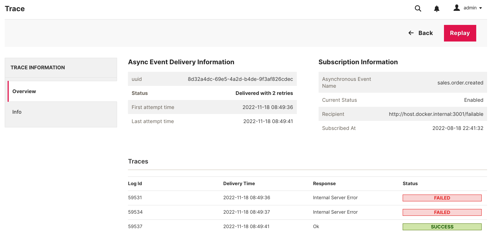
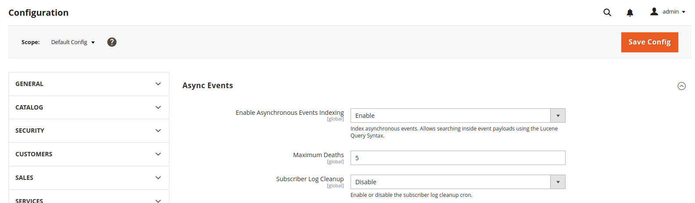
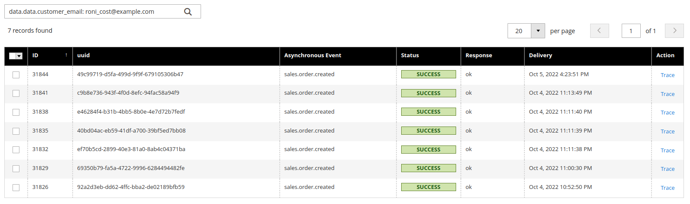
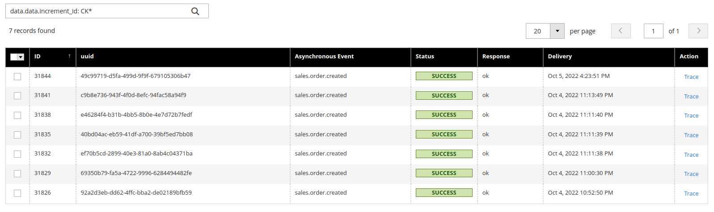

# Magento Asynchronous Events

[](https://github.com/aligent/magento-async-events/actions/workflows/integration-tests.yml)
[](https://github.com/aligent/magento-async-events/actions/workflows/api-functional-tests.yml)

A framework for reliably handling asynchronous events with Magento.

* **Asynchronous**: The module uses RabbitMQ (or DB queues) to leverage asynchronous message delivery.
* **Flexible**: Decoupling events and dispatches provide greater flexibility in message modelling.
* **Scalable**: Handles back pressure and provides an asynchronous failover model automatically.

## Support

| Async Events | Magento 2.3.x      | >= Magento 2.4.0 <= Magento 2.4.3 | >= Magento 2.4.4   |
|--------------|--------------------|-----------------------------------|--------------------|
| 2.x          | :white_check_mark: | :white_check_mark:                | :x:                |
| 3.x          | :x:                | :x:                               | :white_check_mark: |

## Installation

```
composer require aligent/async-events
```

## Usage

### Define an asynchronous event

Create a new `async_events.xml` under a module's `etc/` directory.

```xml
<?xml version="1.0"?>
<config
    xmlns:xsi="http://www.w3.org/2001/XMLSchema-instance"
    xsi:noNamespaceSchemaLocation="urn:magento:module:Aligent_AsyncEvents:etc/async_events.xsd"
>
    <async_event name="sales.order.created">
        <service class="Magento\Sales\Api\OrderRepositoryInterface" method="get"/>
    </async_event>
</config>
```

### Create Subscription

#### HTTP Subscription
```shell
curl --location --request POST 'https://m2.dev.aligent.consulting:44356/rest/V1/async_event' \
--header 'Authorization: Bearer TOKEN' \
--header 'Content-Type: application/json' \
--data-raw '{
    "asyncEvent": {
        "event_name": "sales.order.created",
        "recipient_url": "https://example.com/order_created",
        "verification_token": "fD03@NpYbXYg",
        "metadata": "http"
    }
}'
```

#### Amazon EventBridge Subscription
Requires the [EventBridge Notifier](https://github.com/aligent/magento2-eventbridge-notifier)

```shell
curl --location --request POST 'https://m2.dev.aligent.consulting:44356/rest/V1/async_event' \
--header 'Authorization: Bearer TOKEN' \
--header 'Content-Type: application/json' \
--data-raw '{
    "asyncEvent": {
        "event_name": "sales.order.created",
        "recipient_url": "arn:aws:events:ap-southeast-2:005158166381:rule/Test.EventBridge.Rule",
        "verification_token": "aIW0G9n3*9wN",
        "metadata": "event_bridge"
    }
}'
```

### Dispatch an asynchronous event
```php
public function execute(Observer $observer): void
{
    /** @var Order $object */
    $object = $observer->getEvent()->getData('order');

    // arguments are the inputs required by the service class in the asynchronous
    // event definition in async_events.xml
    // e.g: Magento\Sales\Api\OrderRepositoryInterface::get
    $arguments = ['id' => $object->getId()];
    $data = ['sales.order.created', $this->json->serialize($arguments)];

    $this->publisher->publish(
        QueueMetadataInterface::EVENT_QUEUE,
        $data
    );
}
```

Ensure the following consumers are running

```shell
bin/magento queue:consumer:start event.trigger.consumer
bin/magento queue:consumer:start event.retry.consumer
```

## Advanced Usage
Refer to the [Wiki](https://github.com/aligent/magento-async-events/wiki)


# Features

## Trace

All events are logged at the individual subscription level with a UUID.

All information from the first delivery attempt to the latest attempt is presented as a trace table. The event payload
is also available to view for investigation purposes.



## Retries

Events are automatically retried with exponential back off. The default retry limit is 5. The maximum backoff is
60 seconds.

The exponential backoff is calculated as `min(60, pow($deathCount, 2));`

| Attempt | Backoff     |
|---------|-------------|
| 1       | 1 second    |
| 2       | 4 seconds   |
| 3       | 9 seconds   |
| 4       | 16 seconds  |
| 5       | 25 seconds  |

To change the default retry limit visit Admin > Stores > Settings > Configuration > Advanced > System > Async Events and update `Maximum Deaths`.



## Replays

An event can be replayed independent of its status. This is useful to debug or replay an event when all retries are
exhausted.

Replays start a new chain of delivery attempts and will respect the same retry mechanism if they fail again.

## Lucene Query Syntax

All events are indexed in Elasticsearch by default. This allows you to search through events including the event payload!

The module supports [Lucene Query Syntax](https://lucene.apache.org/core/2_9_4/queryparsersyntax.html) to query event data like attributes.

The following attributes are available across all asynchronous events.

```
log_id
uuid
event_name
success
created
```
The following attributes differ between asynchronous event types.
```
data
```

### Examples

Assuming you have the following events configured
```
customer.created
customer.updated
customer.deleted
sales.order.created
sales.invoice.created
shipment.created
shipment.updated
shipment.deleted
```
You can query all customer events by using a wildcard like `event_name: customer.*` which matches the following events
```
customer.created
customer.updated
customer.deleted
```

You can query all created events like `*.created` which matches the following events
```
customer.created
sales.order.created
sales.invoice.created
shipment.created
```

You can further narrow down using the other available attributes such as status or uuid.

The following query returns all customer events which have failed. `customer.* AND success: false`

You can combine complex lucene queries to fetch event history and then export them via the admin grid as a csv if you wish.

#### Searching inside event payloads
Searching an event payload depends on what event you are searching on.

For the following example event payload, four properties are indexed as attributes. Therefore, you can query on
`data.customer_email`, `data.customer_firstname`, `data.customer_lastname` and `data.increment_id`.
Properties inside array at any level are not searchable.

```json
{
    "data": {
        "customer_email": "roni_cost@example.com",
        "customer_firstname": "Veronica",
        "customer_lastname": "Costello",
        "increment_id": "CK00000001",
        "payment_additional_info": [
            {
                "key": "method_title",
                "value": "Check / Money order"
            }
        ]
    }
}
```

Search all events where the customer email is `roni_cost@example.com`

`data.data.customer_email: roni_cost@example.com`



Search all events with the order increment id starting with `CK` and status success

`data.data.increment_id: CK* AND success: true`



To turn off asynchronous event indexing visit Admin > Stores > Settings > Configuration > Advanced > System >
Async Events and disable `Enable Asynchronous Events Indexing`.
